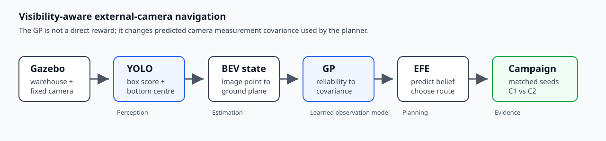

## Overview

This graduation project investigates mobile robot navigation using a fixed external camera instead of relying only on onboard sensing. The system trains a detector in Gazebo, converts detector reliability into a spatial Gaussian Process, and uses that reliability as predictive camera covariance inside an expected-free-energy planner.

The core question is how camera geometry, visibility, and sensor reliability should influence autonomous navigation decisions before localization failure becomes a recovery problem.






## Why This Project

External cameras can provide a useful global view of a robot and its environment, but they also introduce perspective distortion, occlusion, calibration sensitivity, and spatially uneven detection quality. This project makes those constraints explicit instead of treating perception as a perfect input to the planner.

## System

The pipeline is:

```text
Gazebo warehouse
-> YOLO external-camera detector
-> image-space bottom-centre observation
-> BEV state estimate
-> GP reliability query
-> predictive camera covariance
-> EFE route planner
-> seeded campaign metrics
```

## What I Built

- Built a ROS/Gazebo external-camera navigation stack with detector-to-pixel observation, BEV state estimation, and planner integration.
- Trained and evaluated a simulated YOLO detector for robot localization under varying camera visibility.
- Fit a GP reliability model and used it to provide state-dependent camera covariance to the planner.
- Compared constant-covariance planning with visibility-aware planning in a seeded warehouse route-choice benchmark.

## What I Learned

- Perception quality is not just a detector score; it becomes a planning variable once it affects state uncertainty.
- External cameras make geometry and calibration impossible to ignore. The planner can only be as honest as the observation model it receives.
- A useful robotics experiment needs more than a working demo: matched seeds, repeatable scenarios, and clear failure categories matter.

## Public Artifacts

The public repository is structured as a research artifact rather than only source code. The site serves the paper-facing warehouse setup and architecture figure locally, and the project links directly to the source repository and public artifacts folder.

- Code and documentation: ROS/Gazebo simulation, perception, state-estimation, planning, and experiment modules.
- Figures and metrics: paper-facing figures plus seeded benchmark outputs under `paper_artifacts`.
- Reproducibility trail: launch/configuration documentation and route-choice campaign structure.

## Public Result Snapshot

The public repository reports a paper-facing benchmark with four warehouse tasks and five seeds per condition:

| Condition | Planner | Clean reaches | Collisions | Other outcomes |
| --- | --- | ---: | ---: | --- |
| C1 | constant camera covariance | 12/20 | 8/20 | none |
| C2 | visibility-aware covariance | 16/20 | 2/20 | 1 near-success, 1 infrastructure-invalid |

## Artifact Availability

The public artifact folder contains the paper-facing figures and benchmark material that can already be shared. Large generated outputs, intermediate training assets, and final thesis packaging material remain staged until the final release.

## Still Open

- A short overview video.
- Final repository license and citation metadata.
- A fuller artifact/data availability statement after the final thesis release.
