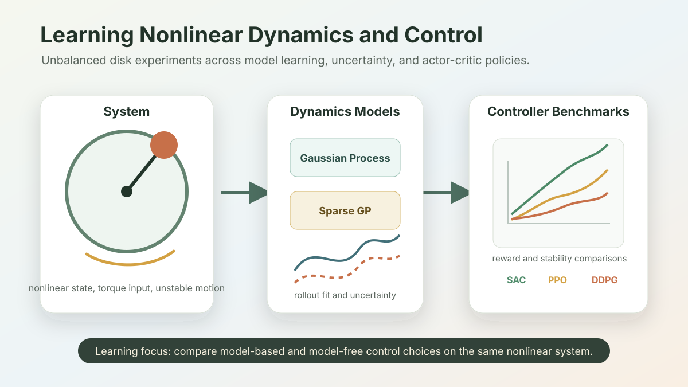

## Overview

This project is a learning-based control case study around an unbalanced disk: a nonlinear dynamical system where the controller must reason about unstable behavior, state representation, model uncertainty, and the trade-off between learned dynamics and learned policies.

The repository is not public, so this page is written as a results-focused portfolio summary. It is meant to show the engineering question, methods, and experiment structure without exposing private coursework or raw code.

## Engineering Question

How well can learned models and learned controllers handle a nonlinear mechanical system when the state representation, normalization, and model class strongly influence stability and control performance?

## Methods

- Nonlinear system identification from measured or simulated trajectories.
- Gaussian Process and sparse Gaussian Process dynamics models.
- Actor-critic reinforcement-learning controllers.
- SAC, PPO, DQN, and a custom DDPG implementation.
- State encoding, normalization, and quantitative comparisons across model/control choices.

## Result Evidence To Publish

A polished public version should include:

- A schematic or short video of the unbalanced disk setup.
- Rollout plots comparing learned dynamics against measured dynamics.
- Reward curves for each controller.
- Stability or tracking metrics across methods.
- A short table explaining where each method failed or generalized.

| Evidence type | What it should demonstrate |
| --- | --- |
| Rollout plot | Learned dynamics versus measured or simulated trajectories |
| Reward curve | Convergence and stability differences across SAC, PPO, DQN, and DDPG |
| Failure table | Which methods were sensitive to state encoding, scaling, or exploration |
| Control metric | Tracking, stabilization, or energy-use comparison on held-out rollouts |

## My Contribution

The strongest portfolio angle is breadth: this project shows nonlinear control and model learning, not another mobile robot navigation stack. It demonstrates that I can compare model-based and model-free learning approaches, reason about state encodings, and turn algorithmic differences into measurable control behavior.

## Source Availability

Source code is private for now. A cleaned repository would be useful once the experiment scripts, report figures, and reproducible results are separated from coursework scaffolding.
