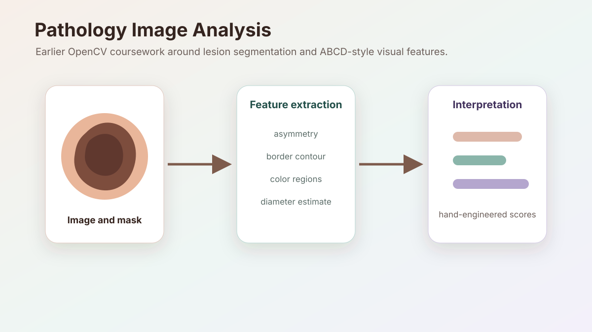

## Overview

This is earlier computer-vision coursework around skin-lesion image analysis. The project explored whether an algorithm could assess melanoma-related visual features from an image using color, asymmetry, diameter, and border characteristics.

I keep this separate from the main robotics projects because it is older, but it is a useful snapshot of early image-processing work: segmentation, hand-built features, and the gap between a visual heuristic and a reliable measurement.

## Approach

The project followed the ABCD-style analysis idea:

- Asymmetry from blob overlap after flipping regions around the lesion center.
- Border features from contour extraction.
- Color-region scoring from thresholded masks.
- Diameter-related measurements from segmented lesion geometry.

## What I Learned

- Hand-engineered features can be intuitive, but they are sensitive to segmentation quality and dataset assumptions.
- Medical-looking image tasks need much more care around evaluation, data provenance, and claims than ordinary visual demos.
- The same OpenCV basics, such as masks, contours, and color spaces, show up again later in robotics perception.

## Notes

There are multiple related repositories from this period, so this page links only the clearest team-owned version rather than splitting old coursework across several project pages.

A useful cleanup is to consolidate the duplicated repositories, document the dataset and evaluation protocol more clearly, and separate exploratory scripts from a clean reproducible pipeline.
