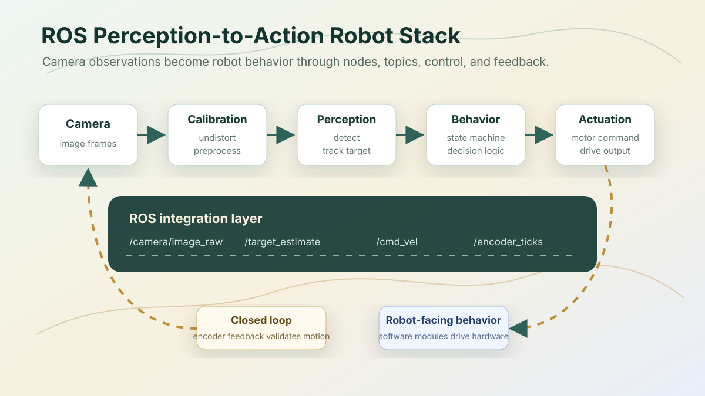

## Overview

This project is about the practical part of robotics that sits between a camera feed and a moving robot. The goal was not to train or evaluate a model offline, but to make observations turn into behavior through ROS nodes, control logic, and hardware feedback.



## System Shape

```text
Camera
-> calibration and image preprocessing
-> detection or gesture recognition
-> target estimate
-> behavior logic
-> motor command
-> encoder feedback
```

## Components

- Camera calibration and image-processing pipeline.
- Detection, tracking, or gesture-recognition logic.
- Target-estimation interface for downstream behavior.
- ROS nodes for perception, decision logic, and actuation.
- Encoder feedback for closing the loop between command and motion.
- Natural-language or high-level robot-command experiments where appropriate.

## What The Stack Shows

| Layer | What matters |
| --- | --- |
| Perception | Camera calibration, preprocessing, detection/tracking, and target-estimation interface |
| Decision logic | Behavior/state-machine layer that turns estimates into robot-facing commands |
| Control | Motor-command interface with encoder feedback for closing the loop |
| System glue | Message boundaries, launch structure, and debugging across nodes |

## What I Learned

- Integration is its own engineering problem. A good perception module is not enough if timing, messages, and control interfaces are unclear.
- Encoder feedback changes the feel of the system because commands become observable rather than just assumed.
- ROS makes boundaries explicit, which is useful, but only if topics, frames, and node responsibilities stay simple.

## Current State

The code is not currently published as a clean standalone repository. The useful next step is to separate the main ROS nodes from development clutter, add a launch file, document the message interfaces, and include a short demo clip.
