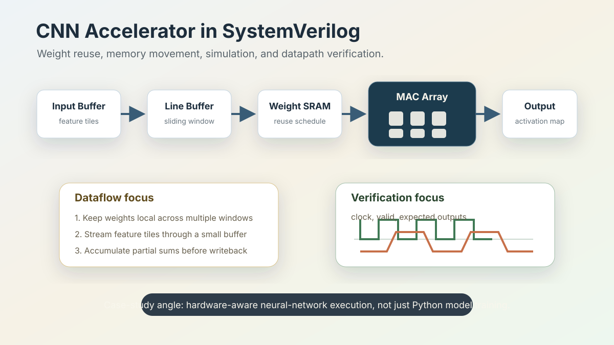

## Overview

This project sits on the hardware side of AI systems. It focuses on implementing and verifying a CNN accelerator in SystemVerilog, with attention to data movement, reuse, simulation, and correctness.



## What I Focused On

The interesting part was not just writing RTL, but understanding how neural-network computation changes when memory movement and datapath structure matter:

- Weight-reuse dataflow for convolutional computation.
- Memory and compute organization for neural-network layers.
- Simulation-driven verification of datapath behavior.
- Testbench design and result checking.
- Trade-offs between hardware structure, throughput, and implementation complexity.

## What To Inspect

| Evidence type | What it demonstrates |
| --- | --- |
| Datapath diagram | How input tiles, weights, MACs, accumulation, and output buffers connect |
| Waveform screenshot | Valid/ready behavior and expected output timing in simulation |
| Verification table | Representative kernels or layers checked against reference outputs |
| Resource note | Hardware trade-offs around reuse, buffering, and throughput |

## What I Learned

- A CNN layer is not just math once it reaches hardware; buffering, reuse, and timing are the hard parts.
- Verification needs to be designed with the datapath, not added after it.
- Working in SystemVerilog made the cost of every data movement much more concrete than in Python.

## Notes

The source is not currently published. The diagram captures the structure and learning points without exposing the original coursework repository.
